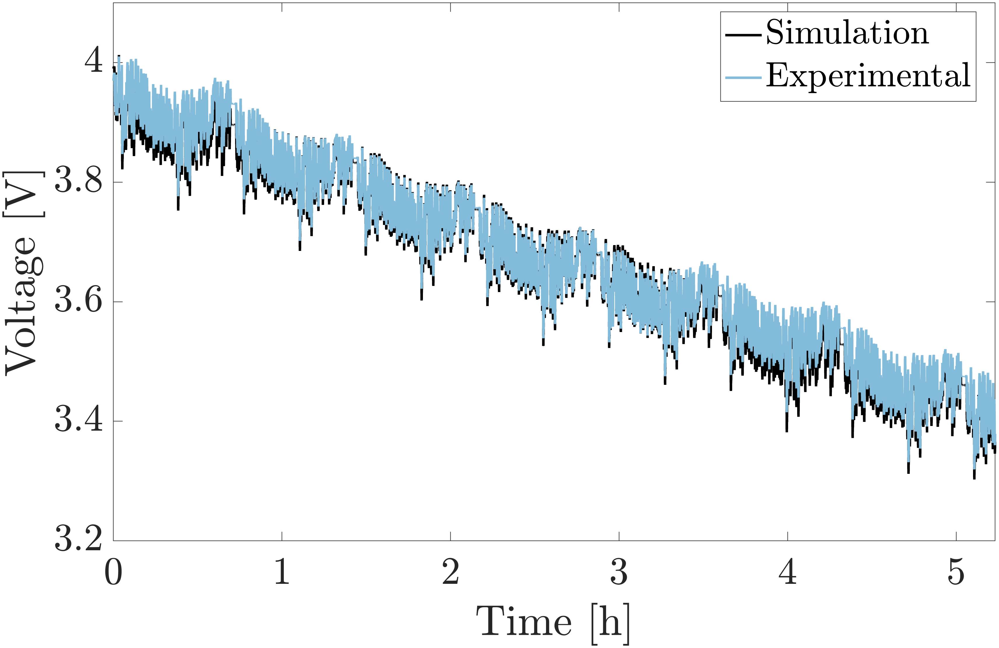
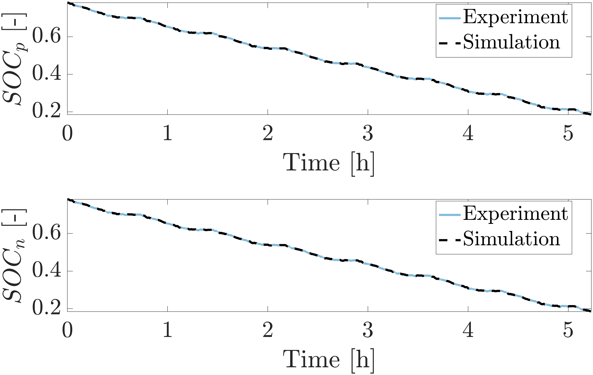

# Summary
COBRAPRO (**Co**-simulation **B**atte**r**y Modeling for **A**ccelerated **P**a**r**ameter **O**ptimization) is a physics-based battery modeling software with the capability to perform closed-loop parameter optimization using experimental data. COBRAPRO is based on the Doyle-Fuller-Newman (DFN) model [@doyle_modeling_1993], which is the most widely-accepted high-fidelity model that considers the lithium-ion transport and charge conservation in the liquid electrolyte and solid electrodes, and kinetics at the solid and liquid interface during lithium intercalation and deintercalation. Such physics-based models have found applications in battery design [@dai_graded_2016], [@couto_lithiumion_2023] and advanced battery management systems to ensure reliable and safe operation of electric vehicles [@kolluri_realtime_2020]. The DFN model is characterized by several physical parameters, such as geometric, stoichiometric, concentration, transport, and kinetic, which are often unknown and need to be determined to accurately predict battery response under various usage scenarios. Direct measurements through cell tear-down experiments is a viable but labor-intensive process [@ecker_parameterization_2015a], [@schmalstieg_full_2018a], [@chen_development_2020]. Furthermore, parameters obtained through experimental characterization may necessitate further calibration [@chen_development_2020] to ensure suitability for use in the DFN model, since the model is a simplified representation of a real battery, assuming perfectly spherical particles, neglecting electrode heterogeneity, and considering internal dynamics in only one dimension. With COBRAPRO, users can noninvasively identify parameters for any given battery using readily available current-voltage data from a battery cycler. COBRAPRO optimizes the DFN parameters by minimizing the error between the simulated and experimentally observed data through an embedded parameter optimization routine.

# Statement of need

Currently, DFN modeling tools lack integrated parameter identification routines, despite their need to accurately predict the dynamical behavior of batteries [@sulzer_python_2021] [@torchio_lionsimba_2016] [@smith_multiphase_2017] [@berliner_methods_2021]. 

COMSOL Multiphysics&copy; [@comsol] is a commercially available finite element modeling software commonly used for DFN simulations. Although COMSOL does not include a built-in parameter identification feature, the *LiveLink&trade; for MATLAB&copy;* enables the creation of a co-simulation parameter optimization routine by establishing communication between the two software platforms. This allows users to leverage the versatile suite of optimizers in MATLAB while running COMSOL to generate the model output [@pozzato_general_2023]. However, the expensive licensing fee and proprietary nature of COMSOL create barriers to public access, limiting collaboration and code reproducibility.

In contrast, several open-source DFN model simulation tools have been released such as PyBaMM [@sulzer_python_2021], LIONSIMBA [@torchio_lionsimba_2016], PETLION [@berliner_methods_2021], DEARLIBS [@lee_robust_2021], fastDFN[@fastDFN], and MPET [@smith_multiphase_2017]. Among these packages, DEARLIBS is the only software with the capability to perform closed-loop parameter identification using experimental data. Other packages rely on literature-derived parameter values to generate simulation results. Taking inspiration from DEARLIBS, COBRAPRO aims to address three primary challenges in the DFN model:

## Challenge 1. Computational complexity 
- **Issue:** The DFN model is also known as the pseudo-two-dimensional (P2D) due to the coupling of the cell thickness (x-direction) and radial particle (r-direction) dimensions. This coupling of dimensions signficantly contributes to the computational complexity of the system.
- **Solution:** COBRAPRO uses a fast solver that significantly improves the model computation speed compared to DEARLIBS. For 10 discretized points in each domain of the cell (positive and negative electrodes, separator, and positive and negative active material particles) at 1C discharge, COBRAPRO solves the DFN model in 0.708 seconds, while DEARLIBS takes 2.54 minutes, which is a two orders of magnitude improvement (~257 times). Under the same simulation conditions, LIONSIMBA and PyBaMM computed the model in 1.13 seconds and 0.237 seconds, respectively, which are comparable to COBRAPRO’s computation time. For larger discretization points, we observed up to three orders of magnitude improvement in computation speed from COBRAPRO to DEARLIBS.

## Challenge 2. Consistent initial conditions
- **Issue:** The partial differential equations (PDEs) governing the DFN model are discretized in the x- and r-directions to form a system of ordinary differential equations (ODEs) and algebraic equations (AEs), also called differential-algebraic equations (DAEs). To solve the DAE system, the correct initial conditions of the AEs are required, which are typically not known *a priori* for the DFN model. Inconsistent initial conditions result in either a failure to start the simulation or the model diverging towards an incorrect solution [@methekar_perturbation_2011].
- **Solution:** The single step approach [@lawder_extending_2015], a robust initialization method, is implemented in COBRAPRO that automatically determines the initial conditions and seamlessly simulates the DFN model.

## Challenge 3. Unknown model parameters
- **Issue:** As highlighted earlier, battery parameters are frequently unknown, and even if obtained through experimental characterization, parameter calibration is essential to accurately model the battery.
- **Solution:** A co-simulation parameter optimization framework is implemented in COBRAPRO. The particle swarm optimization (PSO), a gradient-free population-based algorithm, is employed due to its suitability for nonlinear models like the DFN model. The PSO aims to optimize parameters by minimizing the objective function defined as the error between the experimental and simulated voltage and state of charge (SOC) curves. COBRAPRO employs PSO using MATLAB’s Parallel Computing Toolbox to accelerate PSO convergence through multicore processing.

# Core Capabilities
- **Parameter identification routine:** PSO optimizes parameters using experimental current-voltage data
- **DFN model implementation:** PDEs discretized with finite volume method (FVM) and DAE system solved with SUNDIALS IDA 
- **Solid particle radial discretization options:**
  - FVM and 3rd order Hermite interpolation utilized to calculate particle surface concentration to account for sharp concentration gradients near the particle surface [@xu_comparative_2023] 
  - Finite difference method (FDM)
- **DAE initialization options:**
  - Single-step approach [@lawder_extending_2015]
  - SUNDIALS IDACalcIC
- **Simulating battery cycling:**
  - Constant current (CC) profiles
  - Hybrid pulse power characterization (HPPC) profiles
  - Dynamic current profiles 
- **Local sensitivity analysis (LSA):** Perturbs parameters around their nominal values and evaluates their sensitivity
- **Correlation analysis:** Determines linear correlation calculation between two parameters 

# Example: Case Study on LG 21700-M50T Cells

To demonstrate COBRAPRO's parameter identification routine, a case study is conducted on C/20 capacity test, HPPC, and driving cycle data obtained from LG 21700-M50T cells [@pozzato_lithium_2022]. In this example, we break down the identification problem into a systematic step-by-step process as shown in \autoref{fig:flowchart}. First, the geometric parameters and open-circuit potential functions are extracted from measurements conducted in cell tear-down and half-cell experiments on LG 21700-M50 cells, as reported by [@chen_development_2020]. Next, the C/20 capacity test data is used to identify the stoichiometric parameters, as shown in the example code `DFN_pso_0_05C.m`. Then, a parameter identifiability study consisting of LSA and correlation analysis to determine parameters with high sensitivity to voltage and SOC while having low correlation with other parameters. Refer to [@ha_cobrapro_2024] for more information on parameter identifiability. The identifiable parameters electrolyte transport and kinetic parameters are identified using HPPC data in the example code `DFN_pso_HPPC.m`. Finally, validation of the identified parameters is carried out on the urban dynamometer driving schedule (UDDS) driving cycle data in the code `DFN_UDDS_validation.m`. 

{ width=100% }

## C/20 Capacity Test Identification
In `DFN_pso_0_05C.m`, the `User Input` section is used to define the parameter names, their respective upper and lower bounds, experimental data, PSO settings, etc. A preview of the `User Input` section is provided here.

First, load the `Parameters_LG_INR21700_M50.m` function, which outputs the `param` structure containing the nominal DFN parameters for a LG INR21700-M50 cell and the DFN simulation settings, e.g., discretization method, DAE initialization method, constant or variable current type, etc:
```MATLAB
%% User Input  
% Load nominal parameters 
param = Parameters_LG_INR21700_M50;
```
Enter the your mat file name, which will save an updated `param` structure with the identified parameters from the PSO:
```MATLAB
% Enter mat file name where your PSO results will be stored
file_name = 'identified_parameters_0_05C';
```
Define the names of the parameters you want to identify in variable `param_CC`. In this example, we identify the stoichiometric parameters $\theta_p^{100}$ (`theta100_p`), $\theta_n^{100}$ (`theta100_n`), $\theta_p^0$ (`theta0_p`), and $\theta_n^0$ (`theta0_n`):
```MATLAB
% Enter names of parameters to identify (make sure names match the
% parameter names in "param" structure containing the nominal parameters)
param_CC = {'theta100_p', 'theta100_n', 'theta0_p', 'theta0_n'};
```
Define the lower and upper bounds of the parameters defined in `param_CC`:
```MATLAB
% Enter lower and upper bounds of parameters to identify 
% theta100_p
lower_bounds.theta100_p = 0.22; 
upper_bounds.theta100_p = 0.34;
% theta100_n
lower_bounds.theta100_n = 0.7; 
upper_bounds.theta100_n = 1; 
% theta0_p
lower_bounds.theta0_p = 0.7; 
upper_bounds.theta0_p = 1; 
% theta0_n
lower_bounds.theta0_n = 0.015; 
upper_bounds.theta0_n = 0.04;
```
Load your time, current, and voltage experimental data. In this example, load the C/20 discharge data:
```MATLAB
% Load Experimental Data 
%--------------------------------------------------------------------------
%   t: Should be a vector consisting of your time experiment data      [s] (Mx1)
%   I: Should be a vector consisting of your current experiment data   [A] (Mx1) 
%   V: Should be a vector consisting of your volatge experiemntal data [V] (Mx1)
%   -> where M is the total number of data points in your experiment
%--------------------------------------------------------------------------
% C/20 capacity test conducted on LG INR21700 M50T cells
load('data_INR21700_M50T/capacity_test_data_W8_Diag1.mat')
% Assign your data variables to t, I, and V 
t = t_data;
I = I_data;
V = V_data;
```
Once the all user inputs have been defined, run the `DFN_pso_0_05C.m` code to start the PSO. Once the PSO is finished, the code prints the identified parameters, and the voltage and SOC objective function values to the Command Window:
```
Displaying identified values...
------------------------
theta100_p:
Identified value: 0.26475
0.22(lower) | 0.27(initial) | 0.34(upper)
------------------------
theta100_n:
Identified value: 0.77842
0.7(lower) | 0.9014(initial) | 1(upper)
------------------------
theta0_p:
Identified value: 0.89385
0.7(lower) | 0.9084(initial) | 1(upper)
------------------------
theta0_n:
Identified value: 0.029818
0.015(lower) | 0.0279(initial) | 0.04(upper)

Displaying objective function values...
------------------------
J_V =0.0033403 [-]
J_V =11.8445 [mV]
J_SOCp =0.030231 [%]
J_SOCn =0.019037 [%]
J_tot =0.003833 [-]
```
The code also outputs the plots of the simulation results generated from the identified parameters and the experimental data, as shown in \autoref{fig:V_0_05C} and \autoref{fig:SOC_0_05C}. 

Run `Examples/Parameter_Identification_Results/DFN_pso_0_05C_identification.m` to view the C/20 identification results shown here.

{ width=65% }

{ width=65% }

## HPPC Identification
The `DFN_pso_HPPC.m` file's `User Input` section is similar to the one described in `DFN_pso_0_05C.m`.
First, load your `param` structure, which contains the nominal DFN parameters and any previously identified parameter values. In this example, we load the `identified_parameters_0_05C.mat` file generated from **Example 1**, which contains the identified stoichiometric parameters:
```MATLAB
%% User Input
% Load nominal parameters and stoichiometric parameter identified
% from C/20 discharge data
load('identified_parameters_0_05C.mat','param')
```
Enter the your mat file name, which will save an updated `param` structure containing the HPPC identified parameters:
```MATLAB
% Enter mat file name where your PSO results will be stored
file_name = 'identified_parameters_HPPC';
```
In this demonstration, the HPPC profile is used to identify the unknown kinetic and transport parameters: reaction rate constants in electrodes $k_p$ (`kp`) and $k_n$ (`kn`), electrolyte diffusitivity $D_e$ (`De`), transference number $t_+$ (`t1_constant`), and solid phase diffusitivities $D_{s,p}$ (`Dsp`) and $D_{s,n}$ (`Dsn`):
```MATLAB
% Enter names of parameters to identify (make sure names match the
% parameter names in "param" structure containing nominal parameters)
param_HPPC = {'kp', 'kn', 'Dsp', 'Dsn', 'De', 't1_constant'};
```
Define the upper and lower bounds for each parameter in `param_HPPC`:
```MATLAB
% Enter lower and upper bounds of parameters to identify 
% kp
lower_bounds.kp = 10^(log10(param.kp)*(1+pct));
upper_bounds.kp = 10^(log10(param.kp)*(1-pct));
% kn
...
```
Load the time, current, and voltage vectors generated from the HPPC data:
```MATLAB
% Load Experimental Data 
% HPPC test conducted on LG INR21700 M50T cells
load('data_INR21700_M50T/HPPC_data_W8_Diag1.mat')    
```
Once all user inputs has been defined, run the code to start the PSO. Once the PSO is finished, the identified parameter and objective function values are printed to the Command Window (**Appendix A**). Similar to `DFN_pso_0_05C.m`, the simulation results generated from the identified parameters are plotted against the experimental data, as shown in \autoref{fig:V_HPPC} and \autoref{fig:SOC_HPPC}. 

Run `Examples/Parameter_Identification_Results/DFN_pso_HPPC_identification.m` to view the HPPC identification results shown here.

{ width=65% }

{ width=65% }

## Example 3: Driving cycle validation
In `Examples/Parameter_Identification_Results/DFN_pso_UDDS_validation.m`, the identified parameters are validated using the UDDS driving cycle. The model is simulated under the UDDS profile and compared against the experimental UDDS data. 

In the `User Input` section, load the parameter values identified from C/20 discharge and HPPC data:
```MATLAB
%% User Input  
% Load identification results 
load('identified_parameters_HPPC.mat','param')
```
and load the experimental UDDS data:
```MATLAB
% Load Experimental Data 
% HPPC test conducted on LG INR21700 M50T cells
load('data_INR21700_M50T/UDDS_W8_cyc1.mat')
...
```
The objective function is printed to the Command Window:
```
Displaying objective function values...
------------------------
J_V =0.0036564 [-]
J_V =13.4433 [mV]
J_SOCp =0.03125 [%]
J_SOCn =0.016081 [%]
J_tot =0.0041297 [-]
```
The simulation results and experimental data are plotted as shown in \autoref{fig:V_UDDS} and \autoref{fig:SOC_UDDS}. 

{ width=65% }

{ width=65% }

Visit COBRAPRO's [Github](https://github.com/COBRAPROsimulator/COBRAPRO) to view all example codes:

- `Examples/Parameter_Identification_Routines`: parameter identification examples
  - `DFN_pso_0_05C.m`: parameter identification using C/20 discharge data
  - `DFN_pso_HPPC.m`: parameter identification using HPPC data
- `Examples/Parameter_Identification_Results`: load parameter identification results
  - `DFN_pso_0_05C_identification.m`: C/20 discharge identification results
  - `DFN_pso_HPPC_identification.m`: HPPC identification results
  - `DFN_pso_UDDS_validation.m`: driving cycle validation results
- `Examples/Cycling`: simulating battery cycling examples
  - `cycle_CC.m`: CC cycling experiments and model output visualization 
  - `cycle_HPPC.m`: HPPC profile and model output visualization 
  - `cycle_UDDS.m`: driving cycle profile and model output visualization 
- `Examples/Local_Sensitivity_Analysis`: LSA example codes
  - `DFN_LSA_CC.m`: LSA on CC profile
  - `DFN_LSA_HPPC.m`: LSA on HPPC profile

# Acknowledgements
The authors thank the Bits and Watts Initiative within the Precourt Institute for Energy at Stanford University for its partial financial support. We thank Dr. Le Xu for all the insightful discussions that greatly contributed to the enhancement of COBRAPRO. We extend our thanks to Alexis Geslin, Joseph Lucero, and Maitri Uppaluri for testing COBRAPRO and providing valuable feedback.

## Appendix A 
HPPC identification results printed to Command Window:
```
Displaying identified values...
------------------------
kn:
Identified value: 1.4394e-08
2.987e-15(lower) | 6.7159e-12(initial) | 1.51e-08(upper)
------------------------
Dsp:
Identified value: 7.1026e-15
5.278e-18(lower) | 4e-15(initial) | 3.0314e-12(upper)
------------------------
c0:
Identified value: 599.3499
500(lower) | 1000(initial) | 2000(upper)
------------------------
kp:
Identified value: 3.9537e-08
2.5967e-14(lower) | 3.5445e-11(initial) | 4.8383e-08(upper)
------------------------
Dsn:
Identified value: 2.24e-14
6.6407e-17(lower) | 3.3e-14(initial) | 1.6399e-11(upper)
------------------------
Kappa:
Identified value: 0.75539
0.1(lower) | 0.95(initial) | 2(upper)
------------------------
De:
Identified value: 1.9115e-10
4.9036e-12(lower) | 3.7621e-10(initial) | 2.8863e-08(upper)
------------------------
t1_constant:
Identified value: 0.37071
0.1(lower) | 0.2523(initial) | 0.4(upper)

Displaying objective function values...
------------------------
J_V =0.0037065 [-]
J_V =13.0701 [mV]
J_SOCp =0.13292 [%]
J_SOCn =0.17272 [%]
J_tot =0.0067629 [-]
```
# References
