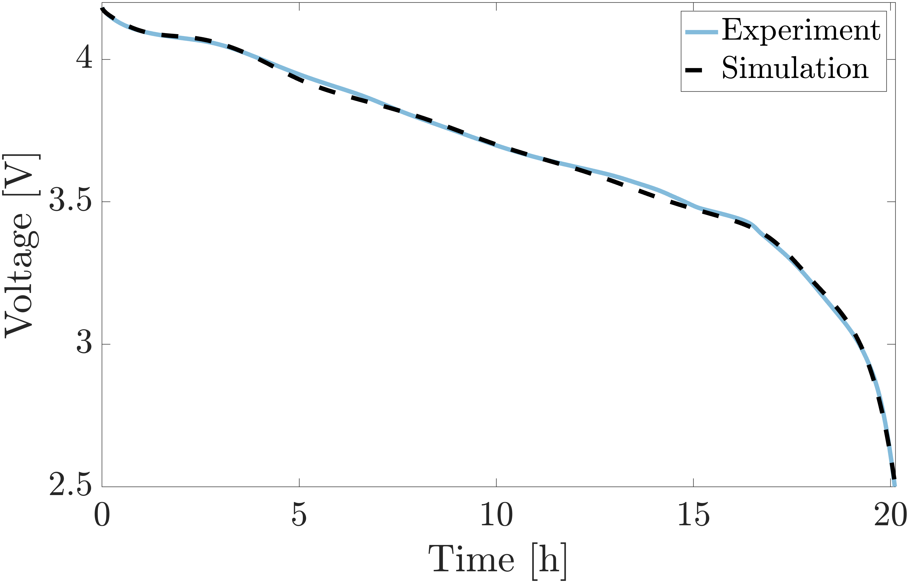
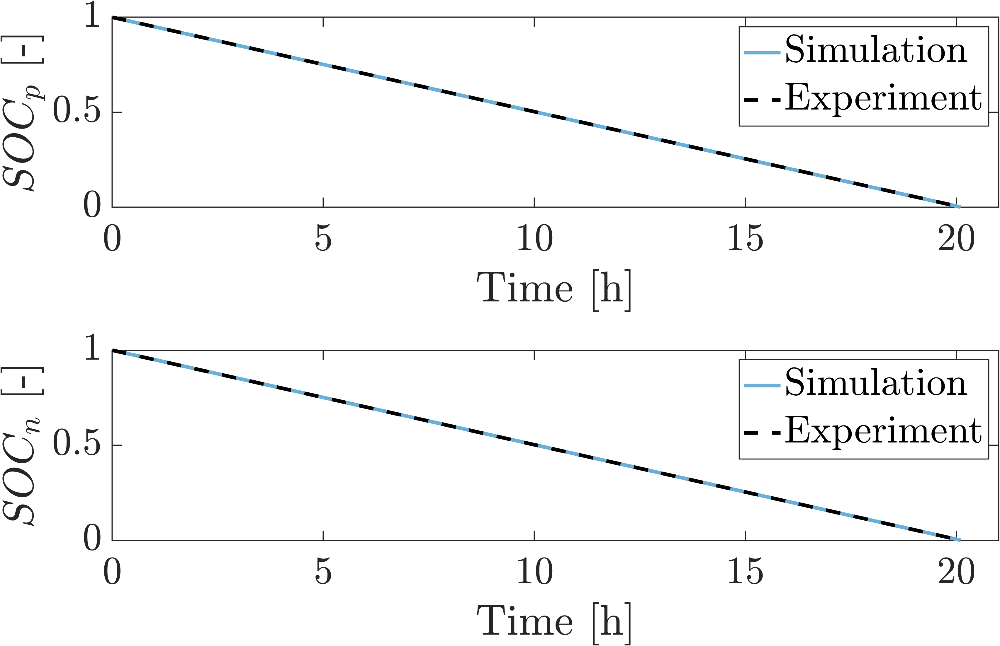
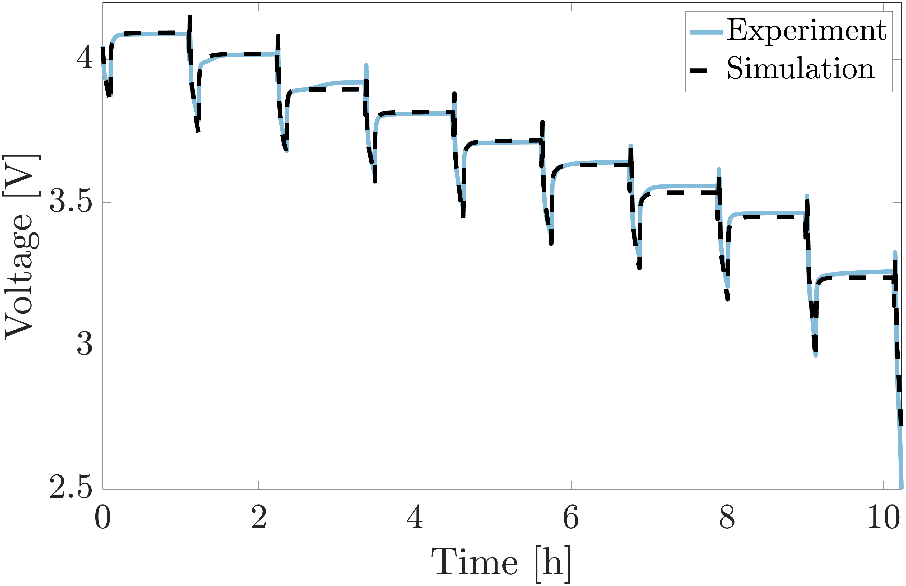
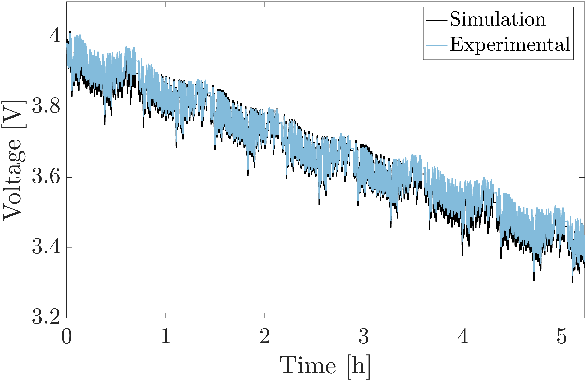

# Summary
COBRAPRO (**Co**-simulation **B**atte**r**y Modeling for **A**ccelerated **P**a**r**ameter **O**ptimization) is a physics-based battery modeling software with the capability to perform closed-loop parameter optimization using experimental data. COBRAPRO is based on the Doyle-Fuller-Newman (DFN) model [@doyle_modeling_1993], which is the most widely-accepted high-fidelity model that considers the lithium-ion transport and charge conservation in the liquid electrolyte and solid electrodes, and kinetics at the solid and liquid interface during lithium intercalation and deintercalation. Such physics-based models have found applications in battery design [@dai_graded_2016], [@couto_lithiumion_2023] and advanced battery management systems to ensure reliable and safe operation of electric vehicles [@kolluri_realtime_2020]. The DFN model relies on physical parameters such as geometric, stoichiometric, concentration, transport, and kinetic properties. Accurate parameter values are essential for the model to predict real battery behavior under various usage conditions. However, parameters obtained from cell teardown experiments cannot be directly applied [@ha_cobrapro_2024],[@li_datadriven_2022], as the DFN model simplifies a real battery, assuming perfectly spherical particles, neglecting electrode heterogeneity, and considering internal dynamics only in one dimension. Parameter identification is therefore crucial for developing models that accurately capture battery dynamics. COBRAPRO enables users to identify these parameters for any battery using standard current-voltage data from a battery cycler, optimizing DFN parameters by minimizing the error between simulated and experimental results through an integrated optimization routine.

# Statement of need

Although parameter calibration is required to accurately predict the dynamical behavior of real batteries, current DFN modeling tools lack the capability to perform parameter identification. 

COMSOL Multiphysics&copy; [@comsol] is a commercially available finite element modeling software commonly used to simulate the DFN model. Although COMSOL lacks a built-in parameter identification feature, it was demonstrated that COMSOL's *LiveLink&trade; for MATLAB*&copy; can be used to establish communication between COMSOL and MATLAB for parameter optimization  [@pozzato_general_2023]. This framework allows users to leverage the versatile suite of optimizers in MATLAB while running COMSOL to generate the model output. However, the expensive licensing fee and proprietary nature of COMSOL create barriers to public access, limiting collaboration and code reproducibility.

In contrast, several open-source DFN model simulation tools have emerged, such as PyBaMM [@sulzer_python_2021], LIONSIMBA [@torchio_lionsimba_2016], PETLION [@berliner_methods_2021], DEARLIBS [@lee_robust_2021], fastDFN [@fastDFN], and MPET [@smith_multiphase_2017]. Among these packages, DEARLIBS is the only software equipped with a closed-loop parameter identification routine. Other open-source pacakges operate as open-loop software, requiring predefined parameters to simulate real battery behavior. Without parameter optimization capabilities, these open-loop tools typically depend on uncalibrated, experimentally measured parameters from the literature. Taking inspiration from DEARLIBS, COBRAPRO aims to address three primary challenges in the DFN model:

## Challenge 1. Computational complexity 
- **Issue:** The DFN model is also known as the pseudo-two-dimensional (P2D) model due to the coupling of the cell thickness (x-direction) and radial particle (r-direction) dimensions. This coupling of dimensions contributes to the model's computational complexity.
- **Solution:** COBRAPRO leverages the SUNDIALS IDA solver [@hindmarsh2005sundials], [@gardner2022sundials] to enable fast computation speed compared to DEARLIBS, which uses MATLAB&copy;'s Symbolic Math Toolbox and ode15 solver. For 1C discharge given 10 discretized points in the electrodes, separator, and particle domains ($N_p=N_s=N_n=N_{rp}=N_{rn}=10$), COBRAPRO solves the DFN model in ~0.708 seconds, while DEARLIBS takes ~2.54 minutes, which is a two orders of magnitude improvement (~257 times). Under identifical simulation conditions, LIONSIMBA and PyBaMM computed the model in ~1.13 seconds and ~0.237 seconds, respectively, demonstrating comparable performance to COBRAPRO. For larger discretization points, COBRAPRO exhibits up to three orders of magnitude improvement in computation speed compared to DEARLIBS. Refer to [@ha_cobrapro_2024] for more details on the computation comparison study between COBRAPRO and other open-source DFN codes.

## Challenge 2. Determining consistent initial conditions
- **Issue:** The partial differential equations (PDEs) governing the DFN model are discretized in x- and r-directions to form a system of ordinary differential equations (ODEs) and algebraic equations (AEs), referred to as differential-algebraic equations (DAEs). To solve the DAE system, it is essential to provide the correct initial conditions for the algebraic variables, which are typically not known *a priori* and must satisfy the AEs in the DFN model [@lee_robust_2021]. Inconsistent initial conditions result in either a failure to start the simulation or the model diverging towards an incorrect solution [@methekar_perturbation_2011].
- **Solution:** The single-step approach [@lawder_extending_2015], a robust initialization method implemented in COBRAPRO and DEARLIBS, modifies the AEs into implicit ODEs to determine consistent initial conditions. This approach eliminates the need for nonlinear algebraic solvers, such as SUNDIALS IDACalcIC or CasADi's rootfinder, which are commonly used in other open-source DFN codes but have been shown to experience convergence issues [@methekar_perturbation_2011]. In [@ha_cobrapro_2024], a comparison study between the single-step approach and SUNDIALS IDACalcIC demonstrates that the single-step approach consistently determines initial conditions across different C-rates and node numbers, outperforming SUNDIALS IDACalcIC. For more details, refer to [@ha_cobrapro_2024].

## Challenge 3. Parameter identifiability and identification 
- **Issue:** Extensive cell teardown experiments [@ecker_parameterization_2015a],[@schmalstieg_full_2018a],[@chen_development_2020] have measured properties such as cell geometry, open-circuit potentials (OCPs), electrolyte characteristics, and solid diffusion coefficients. However, directly using these parameters in the DFN model often leads to inaccurate simulation results. Systematic parameter optimization routines are necessary to develop a well-calibrated model that accurately predicts real battery dynamics. Furthermore, not all parameters in the DFN model are identifiable due to overparametrization [@forman_genetic_2012] and identifiability challenges [@goshtasbi_effective_2020], with identifiability depending on the type of data available.
- **Solution:** COBRAPRO features a co-simulation parameter optimization framework that utilizes particle swarm optimization (PSO) to minimize the multi-objective function [@allam_online_2021],[@xu_comparative_2023], defined as the error between the experimental and simulated voltage and state of charge (SOC) in the electrodes [@ha_cobrapro_2024]. COBRAPRO leverages MATLAB’s Parallel Computing Toolbox to accelerate PSO convergence through multicore processing. Additionally, COBRAPRO supports parameter identifiability analysis, allowing users to conduct local sensitivity analysis (LSA) and correlation analysis to identify a subset of parameters that can be reliably optimized using PSO.
  
# Core Capabilities
- **Parameter identification routine:** PSO optimizes parameters using experimental current-voltage data
- **Parameter identifiability analysis:**
  - LSA: Perturbs parameters around their nominal values and evaluates their sensitivity with respect to voltage and SOC
  - Correlation analysis: Calculates linear correlation between two parameters
  - User-defined sensitivity and correlation index thresholds utilized to determine a set of identifiable parameters
- **DFN model implementation:**
  - PDEs along the x-direction spatially discretized with finite volume method (FVM)
  - PDE along the r-direction spatially discretized with FVM and finite difference method (FDM)
    - To estimate particle surface concentration using FVM, 3rd order Hermite interpolation implemented to account for sharp concentration gradients near the particle surface [@xu_comparative_2023] 
  - SUNDIALS IDA solver used to solve spatially discretized DFN equations
- **Determining consistent initial conditions:**
  - Single-step approach [@lawder_extending_2015]
  - SUNDIALS IDACalcIC [@hindmarsh2005sundials], [@gardner2022sundials]
- **Simulating battery cycling:**
  - Constant current (CC) profiles
  - Hybrid pulse power characterization (HPPC) profiles
  - Dynamic current profiles

# Example: Case Study on LG 21700-M50T Cells

To demonstrate the parameter identification process in COBRAPRO, a case study is conducted to parameterize a fresh LG 21700-M50T cell using the C/20 capacity test, HPPC, and driving cycle data [@pozzato_data_2022]. In this example, we break down the identification problem by systematically grouping parameters in each identification step, as shown in \autoref{fig:flowchart}. This multi-step approach is proposed to improve the identifiability of parameters instead of identifying all the unknown parameters simultaneously [@arunachalam_full_2019]. For detailed information on the multi-objective function and the optimization problem formulated at each identification step, refer to [@ha_cobrapro_2024].

{ width=100% }

Based the analysis from [@ha_cobrapro_2024], the geometric parameters, OCPs, transference number, and equilibrium electrolyte coefficients are determined to be redundant parameters from structural identifiability analysis. Their values are fixed to values measured from cell tear-down and half-cell experiments on LG 21700-M50 cells, as reported by [@chen_development_2020]. Next, the C/20 capacity test data is used to identify the stoichiometric parameters in the example code `DFN_pso_0_05C.m`. A parameter identifiability study is then performed in `DFN_LSA_Corr_HPPC.m`, which includes LSA and correlation analysis to select parameters that exhibit high sensitivity to HPPC voltage and SOC, while maintaining low correlation with other parameters. The identified subset of parameters is then optimized using HPPC data in the `DFN_pso_HPPC.m` code. Finally, the identified parameters are validated with urban dynamometer driving schedule (UDDS) data in the `DFN_UDDS_validation.m` code. All case study codes are located in the Examples folder.

View COBRAPRO's [README on Github](https://github.com/COBRAPROsimulator/COBRAPRO/blob/main/README.md#toc6) to view a list of all available example codes.

## C/20 Capacity Test Identification

In `Examples/Parameter_Identification_Routines/DFN_pso_0_05C.m`, the `User Input` section is used to define the parameter names, PSO settings, experimental data, etc. A preview of the `User Input` section is provided here.

First, load the `Parameters_LG_INR21700_M50.m` function, which outputs a `param` structure containing the nominal (experimentally measured) parameters of a LG INR21700-M50 cell [@chen_development_2020], as well as the DFN simulation settings, e.g., discretization method, method to determine consistent initial condition, constant or variable current type, etc.:
```MATLAB
%% User Input  
% Load nominal parameters 
param = Parameters_LG_INR21700_M50;
```
Enter a mat file name to save the PSO results. The mat file will contain an updated `param` structure that replaces the nominal stoichiometric values with the identified parameters:
```MATLAB
% Enter mat file name where your PSO results will be stored
file_name = 'identified_parameters_0_05C';
```
Define the names of the parameters you want to identify. Here, we identify the stoichiometric parameters $\theta_p^{100}$ (`theta100_p`), $\theta_n^{100}$ (`theta100_n`), $\theta_p^0$ (`theta0_p`), and $\theta_n^0$ (`theta0_n`):
```MATLAB
% Enter names of parameters to identify (make sure names match the
% parameter names in "param" structure containing the nominal parameters)
param_CC = {'theta100_p', 'theta100_n', 'theta0_p', 'theta0_n'};
```
Define the lower and upper bounds of the parameters defined in `param_CC`:
```MATLAB
% Enter lower and upper bounds of parameters to identify 
% theta100_p
lower_bounds.theta100_p = 0.22; 
upper_bounds.theta100_p = 0.34;
% theta100_n
lower_bounds.theta100_n = 0.7; 
upper_bounds.theta100_n = 1; 
% theta0_p
lower_bounds.theta0_p = 0.7; 
upper_bounds.theta0_p = 1; 
% theta0_n
lower_bounds.theta0_n = 0.015; 
upper_bounds.theta0_n = 0.04;
```
Load your time, current, and voltage experimental data. In this example, load the C/20 capacity test data:
```MATLAB
% Load Experimental Data 
%--------------------------------------------------------------------------
%   t: Should be a vector consisting of your time experiment data      [s] (Mx1)
%   I: Should be a vector consisting of your current experiment data   [A] (Mx1) 
%   V: Should be a vector consisting of your voltage experiemntal data [V] (Mx1)
%   -> where M is the total number of data points in your experiment
%--------------------------------------------------------------------------
% C/20 capacity test conducted on LG INR21700 M50T cells
load('data_INR21700_M50T/capacity_test_data_W8_Diag1.mat')
% Assign your data variables to t, I, and V 
t = t_data;
I = I_data;
V = V_data;
```
Once the all user inputs have been defined, run the `DFN_pso_0_05C.m` code to start the PSO. Once the PSO is finished, the code prints the identified parameter values, and the HPPC voltage and SOC objective function values to the Command Window:
```
Displaying identified values...
------------------------
theta100_p:
Identified value: 0.26475
0.22(lower) | 0.27(initial) | 0.34(upper)
------------------------
theta100_n:
Identified value: 0.77842
0.7(lower) | 0.9014(initial) | 1(upper)
------------------------
theta0_p:
Identified value: 0.89385
0.7(lower) | 0.9084(initial) | 1(upper)
------------------------
theta0_n:
Identified value: 0.029818
0.015(lower) | 0.0279(initial) | 0.04(upper)

Displaying objective function values...
------------------------
J_V =0.0033403 [-]
J_V =11.8445 [mV]
J_SOCp =0.030231 [%]
J_SOCn =0.019037 [%]
J_tot =0.003833 [-]
```
The code also plots the simulation results generated from the identified parameters and the experimental data, as shown in \autoref{fig:V_0_05C} and \autoref{fig:SOC_0_05C}. 

Run `Examples/Parameter_Identification_Routines/DFN_pso_0_05C_identification.m` to replicate the results shown here (code will load the identified parameters shown in this case study). 

{ width=65% }

{ width=65% }

## Parameter Identifiability Analysis
In `Examples/Parameter_Identifiability_Analysis/DFN_LSA_Corr_HPPC.m`, parameter identifiability analysis is conducted to determine a subset of identifiable parameters given the HPPC profile. In the `User Input` section, load the `param` structure that contains the identified stoichiometric parameter values from `DFN_pso_0_05C.m`:
```MATLAB
%% User Input
% Load nominal parameters and identified stoichiometric parameters
% from C/20 capacity test data
load('identified_parameters_0_05C.mat','param')
```
Next, enter the names of the parameters for the identifiability analysis. These include the remaining parameters, excluding the structurally redundant parameters and stoichiometric coefficients, as outlined in the analysis by [@ha_cobrapro_2024]:
```MATLAB
%--------------------------------------------------------------------------
% Enter names of parameters to conduct LSA (make sure names match the
% parameter names in "param" structure containing nominal parameters)
%--------------------------------------------------------------------------
param_LSA_HPPC = {'Rc' 'Dsp' 'Dsn' 'kp' 'kn' 'De' 'Kappa' 'sigmap' 'sigman'};
```

Enter the name of the mat file to store the list of identifiable parameters:
```MATLAB
%--------------------------------------------------------------------------
% Enter mat file name where the identifiable parameters will be stored
%--------------------------------------------------------------------------
file_name = 'HPPC_identifiable_params';
```

Set the LSA perturbation coefficient and the correlation coefficient threshold values (refer to [@ha_cobrapro_2024] for more details). In this example, five different correlation coefficient thresholds ($\beta = 0.8, 0.9, 0.95, 0.98, 0.99$) are investigated, resulting in five identifiable parameter sets, one for each threshold value:
```MATLAB
%--------------------------------------------------------------------------
% Perturbation coefficient for LSA [-]
%--------------------------------------------------------------------------
pct=0.05;

%--------------------------------------------------------------------------
% Define correlation coefficient threshold
%--------------------------------------------------------------------------
% Correlation coefficient threshold used to determine the uncorrelated parameter  
% vector prioritized by sensitivity, which will be considered the "identifiable"
% parameters for the HPPC profile (input vector to yield multiple identifiable
% parameter sets for each correlation threshold)
%--------------------------------------------------------------------------
beta_corr = [0.8 0.9 0.95 0.98 0.99];
```

Load the HPPC simulation conditions from `HPPC_W8_Diag1.mat`, which including the current magnitude (`curr_vec`) and time duration (`time_vec`) for each step in the HPPC profile:
```MATLAB
%--------------------------------------------------------------------------
% Load HPPC profile input current vector [A] and simulation time [s] 
%--------------------------------------------------------------------------
% Load HPPC_W8_Diag1.mat file that consists of curr_vec and time_vec
load('HPPC_W8_Diag1.mat') 
```
Once all the user inputs have been defined, run the code to start the identifiability analysis. The code will output figures showing plots of parameter sensitivities as a function of time, sensitivity index of each parameter, and the correlation matrix. The identifiable parameter subsets determined for each correlation coeffient threshold is printed to the Command Window:
```MATLAB
------------------------------------------------
Identifiable parameters from LSA and correlation analysis:
------------------------------------------------
Rc Dsp Dsn (threshold = 0.8)
Rc Dsp Dsn (threshold = 0.9)
Rc Dsp Dsn De (threshold = 0.95)
Rc Dsp Dsn De (threshold = 0.98)
Rc Dsp Dsn kp De (threshold = 0.99)
```

## HPPC Identification
In `Examples/Parameter_Identification_Routines/DFN_pso_HPPC.m`, the identifiable parameters determined from `DFN_LSA_Corr_HPPC.m` are identified using PSO.
First, load your `param` structure, which contains the identified stoichiometric parameter values from `DFN_pso_0_05C.m`. In this example, we load the `identified_parameters_0_05C.mat` file, which contains a `param` structure with the identified stoichiometric parameter values from `DFN_pso_0_05C.m`:
```MATLAB
%% User Input
% Load nominal parameters and identified stoichiometric parameters
% from C/20 capacity test data
load('identified_parameters_0_05C.mat','param')
```
When defining the names of the HPPC parameters to identify, users can manually type the parameters (Option 1) or load the parameter identifiability results generated from `DFN_LSA_Corr_HPPC.m` (Option 2). 

Here, Option 2 is demonstrated by loading `HPPC_identifiable_params.mat`, which is generated from `DFN_LSA_Corr_HPPC.m` and contains five identifiable parameter sets for $\beta = 0.8, 0.9, 0.95, 0.98, 0.99$. In this example, the parameter set corresponding to $\beta=0.95$ is selected for PSO, by defining `beta_value = 0.95`:
```MATLAB
%--------------------------------------------------------------------------
% Option 2: Load identifiable parameters from identifiability analysis
% conducted in "Examples/Local_Sensitivity_Analysis/DFN_LSA_Corr_HPPC.m"
%--------------------------------------------------------------------------
load('HPPC_identifiable_params.mat')
% Enter desired beta value
beta_value = 0.95;
```

Enter the MAT file name to save an updated param structure containing the PSO results:
```MATLAB
% Enter mat file name where your PSO results will be stored
file_name = 'identified_parameters_HPPC_0_95Corr';
```

Define the upper and lower bounds for each parameter in `param_HPPC`:
```MATLAB
% Enter lower and upper bounds of parameters to identify 
% Dsp
pct = 0.2; % perturbation coeff
lower_bounds.Dsp = 10^(log10(param.Dsp)*(1+pct));
upper_bounds.Dsp = 10^(log10(param.Dsp)*(1-pct));
...
```
Load the time, current, and voltage vectors generated from the HPPC data:
```MATLAB
% Load Experimental Data 
% HPPC test conducted on LG INR21700 M50T cells
load('HPPC_data_W8_Diag1.mat')    
```
PSO settings can also be modified in the `User Input` section:
```MATLAB
particle_num = 100;
exit_type = 'MaxStallIterations';
max_iterations = 5;
max_stall_tolerance = 0.5e-6;
social_adjustment = 3.6; 
self_adjustment = 0.3;  
```
Once all user inputs has been defined, run the code to start the PSO. Once the PSO is completed, the identified parameter and objective function values are printed to the Command Window:
```MATLAB
Displaying identified values...
------------------------
Rc:
Identified value: 0.02339
0.001(lower) | 0.02339(initial) | 0.02339(upper)
------------------------
De:
Identified value: 7.1555e-11
6.6922e-13(lower) | 7.1555e-11(initial) | 7.6509e-09(upper)
------------------------
Dsp:
Identified value: 1.3732e-12
3.7936e-16(lower) | 1.3732e-12(initial) | 4.9706e-09(upper)
------------------------
Dsn:
Identified value: 1.6399e-11
9.5335e-15(lower) | 1.6399e-11(initial) | 2.8208e-08(upper)

Displaying objective function values...
------------------------
J_V =0.0050556 [-]
J_V =16.1016 [mV]
J_SOCp =0.13285 [%]
J_SOCn =0.17272 [%]
J_tot =0.0081113 [-]
```
Similar to `DFN_pso_0_05C.m`, the simulation results generated from the identified parameters are plotted against the experimental data, as shown in \autoref{fig:V_HPPC} and \autoref{fig:SOC_HPPC}. 

In `Examples/Parameter_Identification_Results/DFN_pso_HPPC_identification.m`, the results shown here can be replicated by defining the following in the `User Input` section:
```MATLAB
%--------------------------------------------------------------------------
% Enter your identified parameters 
%--------------------------------------------------------------------------
load('identified_parameters_HPPC_0_95Corr.mat')
```
This loads the mat file containing the identified HPPC values using $\beta=0.95$. Note that the identified HPPC values for $\beta=0.90$ or $\beta=0.99$ can also be viewed by loading `identified_parameters_HPPC_0_90Corr.mat` or `identified_parameters_HPPC_0_99Corr.mat` instead.

{ width=65% }

{ width=65% }

## UDDS Driving Cycle Validation
In `Examples/Parameter_Identification_Results/DFN_pso_UDDS_validation.m`, the identified parameters from the C/20 capacity test and HPPC data are validated using the UDDS driving cycle. The model is simulated under the UDDS profile and compared against the experimental UDDS data. 

In the `User Input` section, load the parameter values identified from C/20 and HPPC data:
```MATLAB
%% User Input  
% Load identification results 
load('identified_parameters_HPPC_0_95Corr.mat','param')
```
Note that to run the UDDS validation for the HPPC identification results using $\beta=0.90$ and $\beta=0.99$, load `identified_parameters_HPPC_0_90Corr.mat` or `identified_parameters_HPPC_0_99Corr.mat` instead.

Load the experimental UDDS data:
```MATLAB
% Load Experimental Data 
% HPPC test conducted on LG INR21700 M50T cells
load('data_INR21700_M50T/UDDS_W8_cyc1.mat')
```
The objective function is printed to the Command Window:
```
Displaying objective function values...
------------------------
J_V =0.0037372 [-]
J_V =13.6512 [mV]
J_SOCp =0.032023 [%]
J_SOCn =0.01561 [%]
J_tot =0.0042135 [-]
```
The simulation results and experimental data are plotted as shown in \autoref{fig:V_UDDS} and \autoref{fig:SOC_UDDS}. 

{ width=65% }

{ width=65% }

# Acknowledgements
The authors thank the Bits and Watts Initiative within the Precourt Institute for Energy at Stanford University for its partial financial support. We thank Dr. Le Xu for all the insightful discussions that greatly contributed to the enhancement of COBRAPRO. We extend our thanks to Alexis Geslin, Joseph Lucero, and Maitri Uppaluri for testing COBRAPRO and providing valuable feedback.

# References
