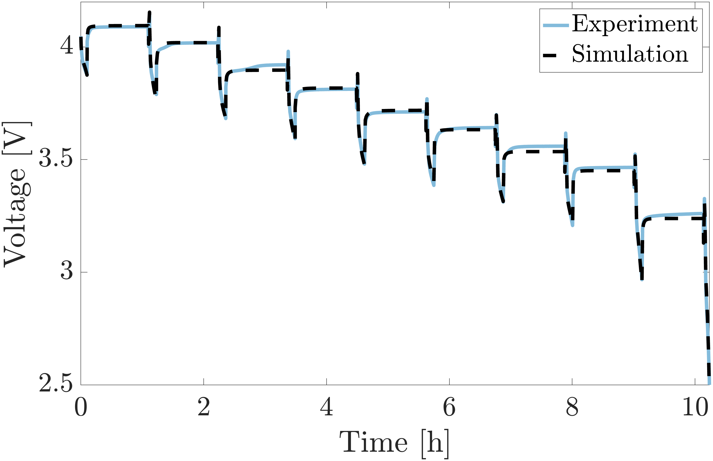
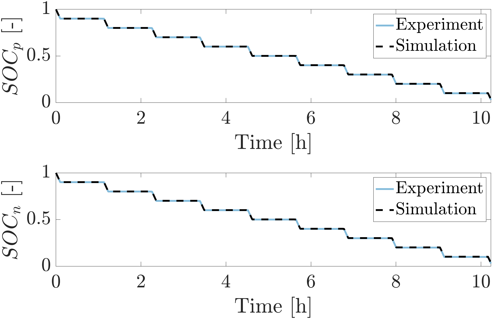

# Summary
COBRAPRO (**Co**-simulation **B**atte**r**y Modeling for **A**ccelerated **P**a**r**ameter **O**ptimization) is a physics-based battery modeling software with the capability to perform closed-loop parameter optimization using experimental data. COBRAPRO is based on the Doyle-Fuller-Newman (DFN) model [@doyle_modeling_1993], which is most widely-accepted high-fidelity model that considers the lithium-ion transport and charge conservation in the liquid electrolyte and solid electrodes, and kinetics at the solid and liquid interface during lithium intercalation and deintercalation. Such physics-based models have found applications in battery design [@dai_graded_2016], [@couto_lithiumion_2023] and advanced battery management systems to ensure reliable and safe operation of electric vehicles [@kolluri_realtime_2020]. The DFN model encompasses several physical parameters, such as geometric, stoichiometric, concentration, transport, and kinetic parameters, which are often unknown and need to be determined to accurately predict battery response under various usage scenarios. Direct measurement through cell tear-down experiments is a viable but labor-intensive process [@ecker_parameterization_2015a], [@schmalstieg_full_2018a], [@chen_development_2020]. Furthermore, parameters obtained through experimental characterization may not be suitable for the DFN model [@chen_development_2020]. The DFN model simplifies the representation of a real battery by assuming perfectly spherical particles, neglecting electrode heterogeneity, and considering internal dynamics in only one dimension. With COBRAPRO, users can noninvasively identify parameters for any given battery using readily available current-voltage data from a battery cycler. COBRAPRO optimizes the DFN parameters by minimizing the error between the simulated and experimentally observed data through an embedded parameter optimization routine.

# Statement of need

Currently, battery DFN modeling tools lack integrated identification routines and primarily rely on parameter values obtained from literature [@sulzer_python_2021] [@torchio_lionsimba_2016] [@smith_multiphase_2017] [@berliner_methods_2021]. COMSOL Multiphysics&copy; [@comsol], a commercially available finite element modeling software utilized for DFN simulations, features a Battery Design Module [@comsol_battery] with a parameter library for various chemistries. However, inherent material inconsistencies and manufacturing cell-to-cell variability [@harris_failure_2017] may render parameters provided by COMSOL unsuitable for modeling a battery even with the same chemistry and electrolyte material. Additionally, COMSOL lacks a built-in parameter identification feature. To address this, one can use COMSOL’s *LiveLink&trade; for MATLAB&copy;* to establish communication between the two software platforms such that results from COMSOL can be transferred to MATLAB to leverage the versatile suite of optimizers in MATLAB [@pozzato_general_2023]. Nonetheless, the expensive licensing fee and proprietary nature of COMSOL create barriers to public access, limiting collaboration and reproducibility.

In contrast, several open-source DFN model simulation tools have been released such as PyBaMM [@sulzer_python_2021], LIONSIMBA [@torchio_lionsimba_2016], PETLION [@berliner_methods_2021], DEARLIBS [@lee_robust_2021], fastDFN[@fastDFN], and MPET [@smith_multiphase_2017]. Among these packages, DEARLIBS is the only software with the capability to perform closed-loop parameter identification using experimental data. Other packages rely on literature-derived parameter values to generate simulation results. Taking inspiration from DEARLIBS, COBRAPRO aims to address three primary challenges in the DFN model.

## Challenge 1. Computational complexity 
- **Issue:** The DFN model is also called the pseudo-two-dimensional (P2D) due to the coupling of the cell thickness (x-direction) and radial particle (r-direction) dimensions, contributing to the computational complexity of the system.
- **Solution:** COBRAPRO uses a fast solver that significantly improves the model computation speed compared to DEARLIBS. For 10 discretized points in each domain of the cell (positive and negative electrodes, separator, and positive and negative active material particles) at 1C discharge, COBRAPRO solves the DFN model in 0.708 seconds, while DEARLIBS takes 2.54 minutes, which is a two orders of magnitude improvement (~257 times). Under the same simulation conditions, LIONSIMBA and PyBaMM computed the model in 1.13 seconds and 0.237 seconds, respectively, which are comparable to the COBRAPRO’s computation time. For larger discretization points, we observed up to three orders of magnitude improvement in computation speed from COBRAPRO to DEARLIBS.

## Challenge 2. Consistent initial conditions
- **Issue:** The partial differential equations (PDEs) governing the DFN model are discretized in the x- and r-directions to form a system of ordinary differential equations (ODEs) and algebraic equations (AEs), also called differential-algebraic equations (DAEs). To solve the DAE system, the correct AEs are required, which are typically not known *a priori* for the DFN model. Inconsistent initial conditions result in either a failure to start the simulation or the model diverging towards an incorrect solution [@methekar_perturbation_2011].
- **Solution:** The single step approach [@lawder_extending_2015], a robust initialization method, is implemented in COBRAPRO that automatically determines the initial conditions and seamlessly simulates the DFN model.

## Challenge 3. Unknown model parameters
- **Issue:** As highlighted earlier, battery parameters are frequently unknown, and even if obtained through experimental characterization, parameter calibration is essential to accurately model the battery.
- **Solution:** A co-simulation parameter optimization framework is developed that determines the parameters by minimizing the cost function, defined in terms of the error between the experimental and simulated voltage and state-of-charge curves. The particle swarm optimization (PSO), a gradient-free population-based algorithm, is employed due to its suitability for nonlinear models like the DFN model. COBRAPRO employs MATLAB’s Parallel Computing Toolbox, accelerating PSO through multicore processing.

# Core Capabilities
- **Parameter identification routine:** Utilizes PSO to optimize parameters using experimental current-voltage data
- **DFN model implementation:** Finite volume method (FVM) discretization of the PDEs to form a DAE and SUNDIALS IDA solver to solve the DAE system
- **Solid particle radial discretization options:**
  - FVM (3rd order Hermite interpolation is utilized to accurately estimate the particle surface concentration to account for the sharp concentration gradients near the particle surface [@xu_comparative_2023])
  - Finite difference method (FDM)
- **DAE initialization options:**
  - Single-step approach [@lawder_extending_2015]
  - SUNDIALS IDACalcIC
- **Simulating battery cycling:**
  - Constant current profiles
  - Hybrid pulse power characterization (HPPC) profiles
  - Dynamic current profiles 
- **Local sensitivity analysis:** Perturbs parameters around nominal values to determine sensitive parameters for a given current profile

# Examples 
Visit COBRAPRO’s [Github](https://github.com/COBRAPROsimulator/COBRAPRO) to view all example codes:
- **Parameter identification routine:** Utilizes PSO to optimize parameters using experimental current-voltage data
- **DFN model implementation:** Finite volume method (FVM) discretization of the PDEs to form a DAE and SUNDIALS IDA solver to solve the DAE system


- `Examples/Cycling`: contains battery cycling example codes
- `Examples/Parameter_Identification_Routines`: contains parameter identification example codes
- `Examples/Parameter_Identification_Results`: contains example codes showing how to load parameter identification results
- `Examples/Local_Sensitivity_Analysis`: contains LSA example codes
  
Here, we provide an overview of the parameter identification example codes in the `Examples/Parameter_Identification_Routines` directory.
Two example codes are provided that demonstrate a two-step parameter identification process. In step 1, the stoichiometric parameters are identified in `DFN_pso_0_05C.m` using the experimentally obtained C/20 discharge profile. In step 2, the electrolyte transport and kinetic parameters are identified in `DFN_pso_HPPC.m` using the experimentally obtained HPPC profile. 

## C/20 Discharge Identification
`DFN_pso_0_05C.m`, located in the `Examples/Parameter_Identification_Routines` directory, is structured to require user input modifications only in the `User Input` section. This section includes definitions for parameter names, their respective upper and lower bounds, and experimental data:
```MATLAB
%% User Input  
% Load nominal parameters 
param = Parameters_LG_INR21700_M50;

% Enter mat file name where your PSO results will be stored
file_name = 'pso_0_05C';

% Enter names of parameters to identify (make sure names match the
% parameter names in "param" structure containing the nominal parameters)
param_CC = {'theta100_p', 'theta100_n', 'theta0_p', 'theta0_n'};

% Enter lower and upper bounds of parameters to identify 
% theta100_p
lower_bounds.theta100_p = 0.22; 
upper_bounds.theta100_p = 0.34;
% theta100_n
lower_bounds.theta100_n = 0.7; 
upper_bounds.theta100_n = 1; 
% theta0_p
lower_bounds.theta0_p = 0.7; 
upper_bounds.theta0_p = 1; 
% theta0_n
lower_bounds.theta0_n = 0.015; 
upper_bounds.theta0_n = 0.04;

% Enter number of particles for PSO
particle_num = 100;

% Load Experimental Data 
%--------------------------------------------------------------------------
%   t: Should be a vector consisting of your time experiment data      [s] (Mx1)
%   I: Should be a vector consisting of your current experiment data   [A] (Mx1) 
%   V: Should be a vector consisting of your volatge experiemntal data [V] (Mx1)
%   -> where M is the total number of data points in your experiment
%--------------------------------------------------------------------------
% C/20 capacity test conducted on LG INR21700 M50T cells
load('data_INR21700_M50T/capacity_test_data_W8_Diag1.mat')
t = t_data;
I = I_data;
V = V_data;

% Enter experimental data initial SOC [-] 
SOC_init = 1;  
```
Note that `Parameters_LG_INR21700_M50.m` function defines the nominal parameters of your cell and the simulation settings, e.g., discretization method, DAE initialization method, current type, etc. 

Once the user input has been defined, run the code to start the PSO. Once the PSO is finished, the code prints the identified parameter values and objective function values to the command window:
```
Displaying identified values...
------------------------
theta100_p:
Identified value: 0.26475
0.22(lower) | 0.27(initial) | 0.34(upper)
------------------------
theta100_n:
Identified value: 0.77842
0.7(lower) | 0.9014(initial) | 1(upper)
------------------------
theta0_p:
Identified value: 0.89385
0.7(lower) | 0.9084(initial) | 1(upper)
------------------------
theta0_n:
Identified value: 0.029818
0.015(lower) | 0.0279(initial) | 0.04(upper)

Displaying objective function values...
------------------------
J_V =0.0033403 [-]
J_V =11.8445 [mV]
J_SOCp =0.030231 [%]
J_SOCn =0.019037 [%]
J_tot =0.003833 [-]
```
to the Command Window and plots the identified results as shown in \autoref{fig:V_0_05C} and \autoref{fig:SOC_0_05C}. 
To view the C/20 identification results shown here, run 
`Examples/Parameter_Identification_Results/DFN_pso_0_05C_identification`.

{ width=60% }

{ width=60% }

## HPPC Identification
Similar to `DFN_pso_HPPC.m`, modify the `User Input` section in `DFN_pso_HPPC.m`, located in the `Examples/Parameter_Identification_Routines` directory.
```MATLAB
%% User Input
% Load nominal parameters and stoichiometric parameter identified
% from C/20 discharge data
% load('identified_parameters_0_05C.mat','param')

% Enter mat file name where your PSO results will be stored
file_name = 'pso_HPPC';
 
% Enter names of parameters to identify (make sure names match the
% parameter names in "param" structure containing nominal parameters)
param_HPPC = {'kp', 'kn', 'Dsp', 'Dsn', 'Kappa', 'De', 't1_constant', 'c0'};
 
% Enter lower and upper bounds of parameters to identify 
% kp
pct = 0.3; % perturbation coeff
lower_bounds.kp = 10^(log10(param.kp)*(1+pct));
upper_bounds.kp = 10^(log10(param.kp)*(1-pct));
% kn
pct = 0.3; % perturbation coeff
lower_bounds.kn = 10^(log10(param.kn)*(1+pct));
upper_bounds.kn = 10^(log10(param.kn)*(1-pct));
% Dsp
pct = 0.2; % perturbation coeff
lower_bounds.Dsp = 10^(log10(param.Dsp)*(1+pct));
upper_bounds.Dsp = 10^(log10(param.Dsp)*(1-pct));
% Dsn
pct = 0.2; % perturbation coeff
lower_bounds.Dsn = 10^(log10(param.Dsn)*(1+pct));
upper_bounds.Dsn = 10^(log10(param.Dsn)*(1-pct));
% Kappa
lower_bounds.Kappa = 0.1;
upper_bounds.Kappa = 2;
% De 
pct = 0.2; % perturbation coeff
lower_bounds.De = 10^(log10(param.De)*(1+pct));
upper_bounds.De = 10^(log10(param.De)*(1-pct));
% t1
lower_bounds.t1_constant = 0.1;
upper_bounds.t1_constant = 0.4;
% c0
lower_bounds.c0 = 500;
upper_bounds.c0 = 1500;

% Enter number of particles for PSO
particle_num = 300;

% Load Experimental Data 
%--------------------------------------------------------------------------
%   t: Should be a vector consisting of your time experiment data      [s] (Mx1)
%   I: Should be a vector consisting of your current experiment data   [A] (Mx1) 
%   V: Should be a vector consisting of your volatge experiemntal data [V] (Mx1)
%   -> where M is the total number of data points in your experiment
%--------------------------------------------------------------------------
% HPPC test conducted on LG INR21700 M50T cells
load('data_INR21700_M50T/HPPC_data_W8_Diag1.mat')

t = t_data;
I = I_data;
V = V_data;

% Enter initial SOC of your HPPC data
SOC_init = 1;   % [-]      
```
Once the user input has been defined, run the code to start the PSO. Once the PSO is finished, the identified parameter values and objective function values are printed to the command window:
```
Displaying identified values...
------------------------
kn:
Identified value: 1.4394e-08
2.987e-15(lower) | 6.7159e-12(initial) | 1.51e-08(upper)
------------------------
Dsp:
Identified value: 7.1026e-15
5.278e-18(lower) | 4e-15(initial) | 3.0314e-12(upper)
------------------------
c0:
Identified value: 599.3499
500(lower) | 1000(initial) | 2000(upper)
------------------------
kp:
Identified value: 3.9537e-08
2.5967e-14(lower) | 3.5445e-11(initial) | 4.8383e-08(upper)
------------------------
Dsn:
Identified value: 2.24e-14
6.6407e-17(lower) | 3.3e-14(initial) | 1.6399e-11(upper)
------------------------
Kappa:
Identified value: 0.75539
0.1(lower) | 0.95(initial) | 2(upper)
------------------------
De:
Identified value: 1.9115e-10
4.9036e-12(lower) | 3.7621e-10(initial) | 2.8863e-08(upper)
------------------------
t1_constant:
Identified value: 0.37071
0.1(lower) | 0.2523(initial) | 0.4(upper)

Displaying objective function values...
------------------------
J_V =0.0037065 [-]
J_V =13.0701 [mV]
J_SOCp =0.13292 [%]
J_SOCn =0.17272 [%]
J_tot =0.0067629 [-]
```
and the identified results are plotted, as shown in \autoref{fig:V_HPPC} and \autoref{fig:SOC_HPPC}. 
To view the HPPC identification results shown here, 
run `Examples/Parameter_Identification_Results/DFN_pso_HPPC_identification`.

{ width=60% }

{ width=60% }

# Acknowledgements
The authors thank the Bits and Watts Initiative within the Precourt Institute for Energy at Stanford University for its partial financial support. We thank Dr. Le Xu for all the insightful discussions that greatly contributed to the enhancement of COBRAPRO. We extend our thanks to Alexis Geslin, Joseph Lucero, and Maitri Uppaluri for testing COBRAPRO and providing valuable feedback.

# References
